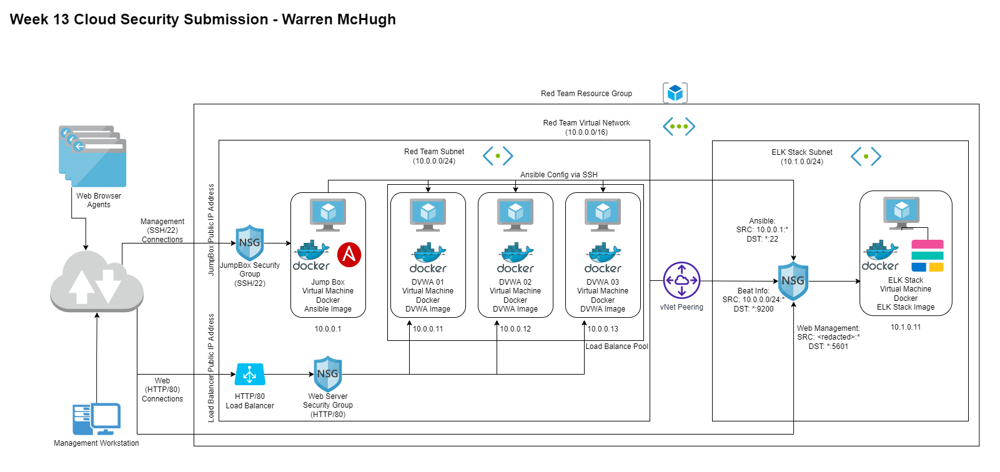

## Automated ELK Stack Deployment

The files in this repository were used to configure the network depicted below.

These files have been tested and used to generate a live ELK deployment on Azure. They can be used to recreate the entire deployment pictured above. Alternatively, select portions of the ansible related files may be used to install only certain pieces of it, such as Filebeat.

  - [Ansible Hosts](ansible/hosts.yml)
  - [Metricbeat Playbook](ansible/roles/metricbeat-playbook.yml)
  - [Filebeat Playbook](ansible/roles/filebeat-playbook.yml)
  - [Ansible Configuration](ansible/ansible.cfg)
  - [Metricbeat Configuration File](ansible/files/metricbeat-config.yml)
  - [Filebeat Configuration File](ansible/files/filebeat-config.yml)
  - [ELK Playbook](ansible/elk.yml)
  - [Pen Test Playbook (DVWA Containers)](ansible/pentest.yml)

This document contains the following details:
- Description of the Topologu
- Access Policies
- ELK Configuration
  - Beats in Use
  - Machines Being Monitored
- How to Use the Ansible Build

### Description of the Topology

The main purpose of this network is to expose a load-balanced and monitored instance of DVWA, the D*mn Vulnerable Web Application.

Load balancing ensures that the application will be highly available, in addition to restricting traffic to the network.

- _What aspect of security do load balancers protect? What is the advantage of a jump box?_
  - The load balancers add resliliency by distributing traffic to multiple web servers.
  - The jump box allows removing direct access to a server from the public network
    and providing a smaller surface area of attack that can be hardened.

Integrating an ELK server allows users to easily monitor the vulnerable VMs for changes to the configuration files and system logs.
  - Filebeat collects and send logs files to the ELK server as well as any changes to
    the specified configuration files.
  - Metricbeat measures system metrics such as CPU usage, disk usage, memory consuption,
    network usage etc and send the information to the ELK stack for analysis

The configuration details of each machine may be found below.

| Name     | Function             | IP Address | Operating System |
|----------|----------------------|------------|------------------|
| Jump Box | Gateway and Ansible  | 10.0.0.1   | Linux            |
| DVWA01   | Web Application      | 10.0.0.11  | Linux            |
| DVWA02   | Web Application      | 10.0.0.12  | Linux            |
| DVWA03   | Web Application      | 10.0.0.13  | Linux            |
| ELK Stack| Runs the ELK Stack   | 10.0.0.13  | Linux            |

### Access Policies

The machines on the internal network are not exposed to the public Internet. 

Only the Jump Box machine can accept connections from the Internet. Access to this machine is only allowed from the following IP addresses:
- 103.107.196.206 (AU#20)

Machines within the network can only be accessed by the Jump Box machine, however the administrative web console of the ELK stack can be accessed only by the .
- _Which machine did you allow to access your ELK VM? What was its IP address?_
  - All web servers can access the metric ports on the ELK VM
  - Only the Jump Box machine can access port 22 on the ELK VM
  - Only the public IP address of the administrative machine can access the
    ELK VMs administrative web page.

A summary of the access policies in place can be found in the table below.

| Name      | Publicly Accessible  | Allowed IP Addresses |
|-----------|----------------------|----------------------|
| Jump Box  | Yes (ssh only)       | 103.107.196.206      |
| DVA01     | No                   | 10.0.0.11            |
| DVA02     | No                   | 10.0.0.12            |
| DVA03     | No                   | 10.0.0.13            |
| ELK STACK | Yes (admin port only)| 103.107.196.206      |                      |

### Elk Configuration

Ansible was used to automate configuration of the ELK machine. No configuration was performed manually, which is advantageous because...
- _What is the main advantage of automating configuration with Ansible?_
  - Ansible lets you quickly and easily deploy multitier applications throug a YAML playbook
  - You don't need to write custom code to automate your systems
  - Ansible figures out how to get your systems to the state you want them to be in

The ELK stack playbook implements the following tasks:
- Specifies the group of machines and to become root
- Install docker
- Install python3 package manager
- Install the python3 docker package
- Increase virtual memory
- Pull and run the docker container with published ports
- Enable the docker service to run on start

The following screenshot displays the result of running `docker ps` after successfully configuring the ELK instance.

### Target Machines & Beats
This ELK server is configured to monitor the following machines:
- 10.0.0.11
- 10.0.0.12
- 10.0.0.13

We have installed the following Beats on these machines:
- Filebeat
- Metricbeat

These Beats allow us to collect the following information from each machine:
  - Filebeat collects and send logs files to the ELK server as well as any changes to
    the specified configuration files.
  - Metricbeat measures system metrics such as CPU usage, disk usage, memory consuption,
    network usage etc and send the information to the ELK stack for analysis

### Using the Playbook
In order to use the playbook, you will need to have an Ansible control node already configured. Assuming you have such a control node provisioned: 

SSH into the control node and follow the steps below:
- Copy the YAML files to the `/ansible/` folder.
- Update the `ansible.cfg` file to include the remote user of the target machines
- Run the playbook, and navigate to web vm load balancer and the elk stack administration page to check that the installation worked as expected.

- _Which file is the playbook? Where do you copy it?_
  - The files in the (ansible/roles)[ansible/roles] folder contain the playbooks that are to be copied to the `/etc/ansible` folder on the ansible machine
- _Which file do you update to make Ansible run the playbook on a specific machine? How do I specify which machine to install the ELK server on versus which to install Filebeat on?_
  - A combination of the *playbook* file to specify the group of machines and the `/etc/ansible/hosts.yml` file to specify the machines in the group
- _Which URL do you navigate to in order to check that the ELK server is running?
  - Navigate to the ip addess of the exposed ELK server using port 5601

_As a **Bonus**, provide the specific commands the user will need to run to download the playbook, update the files, etc._
  - To get a copy of the files clone repo with `git clone git@github.com:ExZyle/usyd-cybersec-bootcamp-project-1.git`
  - Edit the files using your favourite text editor

